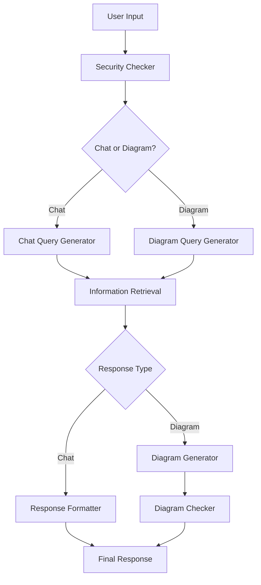
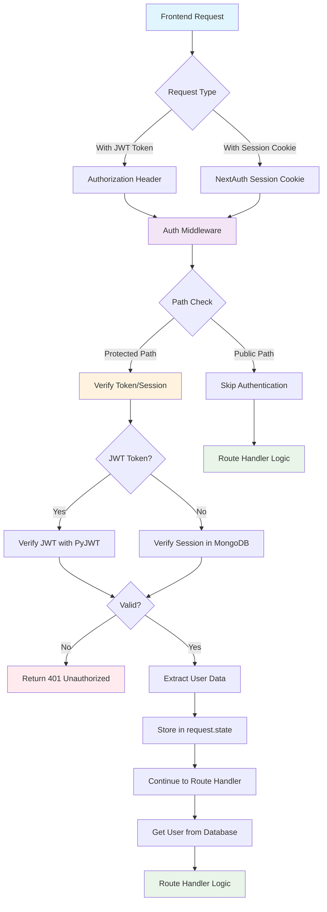

# CodeBuddy Backend

**CodeBuddy** is a sophisticated AI-powered code analysis platform built with FastAPI that helps developers understand, analyze, and visualize their codebases through conversational AI and automated diagram generation.

---

## **🚀 Features**

### **Core Capabilities**
- 🤖 **Multi-Agent AI System** - Sequential agent workflows powered by Google ADK
- 💬 **Conversational Code Analysis** - Chat with AI about your codebase
- 📊 **Automatic Diagram Generation** - Generate Mermaid diagrams from code structure
- 🔍 **Semantic Code Search** - Vector-based similarity search using embeddings
- 🔒 **Repository Processing** - Secure GitHub repository cloning and analysis
- ⚡ **Background Processing** - Celery-based async task queue
- 🛡️ **Security-First Design** - Input validation, credential encryption, secure cloning

### **AI Agent Workflows**
- **Chat Workflow**: Security Checker → Query Generator → Information Retrieval → Response Formatter
- **Diagram Workflow**: Security Checker → Query Generator → Information Retrieval → Diagram Generation → Validation

---

## **🏗️ Architecture Overview**

### **Core Technologies**
- **FastAPI** - Modern, fast web framework with automatic OpenAPI docs
- **Google ADK** - Agent Development Kit for multi-agent AI workflows
- **MongoDB + Motor** - Async NoSQL database operations
- **Celery + Redis** - Distributed task queue for background processing
- **Sentence Transformers** - Vector embeddings for semantic code search
- **Mermaid** - Diagram generation and visualization
- **LiteLLM** - Multi-provider LLM integration
- **Langfuse** - LLM observability and tracing platform

### **Project Structure**

```
backend/
├── app/
│   ├── main.py                    # FastAPI application factory
│   ├── agents/                    # Multi-agent AI system
│   │   ├── agent.py              # Base agent classes
│   │   ├── chat_query_generator_agent/
│   │   ├── diagram_generation_agent/
│   │   ├── information_retrieval_agent/
│   │   ├── response_formatter_agent/
│   │   ├── security_checker_agent/
│   │   ├── prompts/              # Agent prompts and instructions
│   │   └── constants/            # General and Mermaid instructions
│   ├── api/
│   │   └── dependencies.py       # FastAPI dependency injection
│   ├── auth/                      # NextAuth JWT authentication system
│   │   ├── __init__.py           # Auth module exports
│   │   ├── jwt_handler.py        # JWT/session token verification
│   │   ├── middleware.py         # Authentication middleware
│   │   ├── dependencies.py      # Auth dependencies for routes
│   │   ├── token_utils.py        # Token extraction utilities
│   │   └── utils.py              # User data processing utilities
│   ├── celery/
│   │   └── worker.py             # Background task processing
│   ├── core/
│   │   ├── logging.py            # Unified loguru logging configuration
│   │   ├── langfuse/             # Langfuse observability integration
│   │   │   ├── __init__.py       # Langfuse exports
│   │   │   ├── client.py         # Langfuse client setup
│   │   │   └── agent_tracing.py  # Multi-agent tracing utilities
│   │   ├── middleware.py         # Credential decryption middleware
│   │   └── responses.py          # Custom response handlers
│   ├── db/
│   │   └── mongodb.py            # MongoDB connection management
│   ├── dto/                      # Data Transfer Objects
│   │   ├── chat_dto.py
│   │   ├── diagram_dto.py
│   │   ├── tools_dto.py
│   │   └── connection_dto.py
│   ├── models/                   # Pydantic data models
│   │   ├── base.py               # BaseModelWithId with MongoDB support
│   │   ├── user.py
│   │   ├── chat.py
│   │   ├── message.py
│   │   └── diagram.py
│   ├── repositories/             # Repository pattern implementation
│   │   ├── base.py               # Generic repository with CRUD operations
│   │   └── implementations.py    # Concrete repository implementations
│   ├── routers/                  # FastAPI route handlers
│   │   ├── tools_router.py       # Repository processing endpoints
│   │   ├── chat_router.py        # Conversational AI endpoints
│   │   ├── diagram_router.py     # Diagram generation endpoints
│   │   └── user_router.py        # User management endpoints
│   ├── utils/                    # Core utilities
│   │   ├── github_handler.py     # Secure repository cloning
│   │   ├── embedder.py           # Code processing and embeddings
│   │   ├── logger.py             # Logger utility for imports
│   │   └── xml_converter.py      # Robust XML parsing
│   └── tests/
│       └── test_tools_router.py  # Unit tests
├── clones/                       # Temporary repository storage
├── logs/                         # Application logs
├── settings.py                   # Pydantic settings configuration
├── requirements.txt              # Python dependencies
├── Dockerfile                    # Container configuration
├── docker-compose.yml           # Multi-service setup
└── CLAUDE.md                    # Development guidelines
```

---

## **🛠️ Quick Start**

### **1. Clone the Repository**

```bash
git clone <repository-url>
cd CodeBuddy/backend
```

### **2. Environment Setup**

#### **Option A: Docker Compose (Recommended)**
```bash
# Start all services (FastAPI, MongoDB, Redis)
docker-compose up --build

# Access the application
# - API: http://localhost:8000
# - Documentation: http://localhost:8000/docs
```

#### **Option B: Local Development**

**Create Virtual Environment:**
```bash
python -m venv venv

# Linux/macOS
source venv/bin/activate

# Windows
venv\Scripts\activate
```

**Install Dependencies:**
```bash
pip install -r requirements.txt
```

**Start Services:**
```bash
# Terminal 1: Start Redis
docker run -p 6379:6379 redis

# Terminal 2: Start MongoDB
docker run -p 27017:27017 mongo

# Terminal 3: Start Celery Worker
celery_config -A app.celery_config.worker.celery_app worker --loglevel=info

# Terminal 4: Start FastAPI Application
uvicorn app.main:app --host 0.0.0.0 --port 8000 --reload
```

---

## **⚙️ Configuration**

### **Environment Variables**

Create a `.env` file in the root directory:

```env
# Application Settings
APPLICATION_NAME=CodeBuddy
APPLICATION_HOST=0.0.0.0
APPLICATION_PORT=8000
APPLICATION_ENVIRONMENT=dev

# Database Configuration
APPLICATION_MONGO_URI=mongodb://localhost:27017
APPLICATION_MONGO_DB=CodeBuddy
# APPLICATION_MONGO_COLLECTION removed - using specific collection constants

# Redis Configuration
APPLICATION_REDIS_URL=redis://localhost:6379/0

# Security
APPLICATION_ENCRYPTION_KEY=<generate-fernet-key>

# CORS Settings
APPLICATION_CORS_ALLOW_ORIGINS=*
APPLICATION_CORS_ALLOW_METHODS=*
APPLICATION_CORS_ALLOW_HEADERS=*

# Langfuse Configuration (LLM Observability)
LANGFUSE_SECRET_KEY=sk-lf-your-secret-key-here
LANGFUSE_PUBLIC_KEY=pk-lf-your-public-key-here
LANGFUSE_HOST=https://cloud.langfuse.com
LANGFUSE_ENABLED=true

# Server Configuration
APPLICATION_UVICORN_WORKERS_COUNT=4
APPLICATION_UVICORN_TIMEOUT=120
APPLICATION_UVICORN_GRACEFUL_TIMEOUT=30
APPLICATION_UVICORN_KEEP_ALIVE=2
```

### **Generate Encryption Key**
```python
from cryptography.fernet import Fernet
print(Fernet.generate_key().decode())
```

### **Setup Langfuse (Optional but Recommended)**

1. **Create Account**: Sign up at [cloud.langfuse.com](https://cloud.langfuse.com)
2. **Get API Keys**: Create a new project and copy your keys
3. **Configure Environment**: Add the keys to your `.env` file
4. **Verify Setup**: Check Langfuse dashboard after making API calls

**Benefits of Langfuse Integration:**
- 🔍 **Debug Multi-Agent Flows**: See exactly where agents succeed/fail
- 📊 **Performance Analytics**: Track response times and costs  
- 🎯 **Quality Monitoring**: Score and evaluate agent responses
- 👥 **User Insights**: Understand user interaction patterns

---

## **📚 API Documentation**

### **Available Endpoints**

#### **🔧 Tools Router** (`/tools/*`)
- `POST /tools/setup` - Initiate repository processing (background task)
- `GET /tools/task-status/{task_id}` - Check background task status
- `GET /tools/health` - Health check

#### **💬 Chat Router** (`/chat/*`)
- `POST /chat/` - Create new chat session
- `GET /chat/{chat_id}` - Retrieve chat session
- `POST /chat/{chat_id}/message` - Send message and get AI response
- `GET /chat/health` - Health check

#### **📊 Diagram Router** (`/diagram/*`)
- `POST /diagram/` - Generate new Mermaid diagram
- `GET /diagram/{diagram_id}` - Get diagram by ID
- `GET /diagram/` - List diagrams by user
- `PATCH /diagram/{diagram_id}` - Update existing diagram
- `GET /diagram/health` - Health check

#### **👤 User Router** (`/user/*`)
- `POST /user/` - Create user
- `GET /user/{user_id}` - Get user by ID
- `GET /user/email/{email}` - Get user by email
- `GET /user/` - List all users
- `GET /user/health` - Health check

### **Interactive Documentation**
- **Swagger UI**: http://localhost:8000/docs
- **ReDoc**: http://localhost:8000/redoc

---

## **🧠 Multi-Agent AI System**

### **Agent Architecture**

The system uses **Google ADK** to orchestrate multiple specialized agents:

1. **Security Checker Agent**
   - Validates user input for security threats
   - Prevents prompt injection attacks
   - Uses `gemini-2.0-flash` model

2. **Query Generator Agents**
   - **Chat Query Generator**: Refines queries for conversational responses
   - **Diagram Query Generator**: Creates structured queries for diagram generation

3. **Information Retrieval Agent**
   - Searches code chunks using vector embeddings
   - Integrates with GitHub and Jira MCP tools
   - Uses `search_similar_code_chunks` function

4. **Response Formatter Agent**
   - Formats AI responses with proper markdown
   - Supports code highlighting and Mermaid diagrams

5. **Diagram Generation Agent**
   - Creates Mermaid diagrams from code analysis
   - Supports multiple diagram types (flowchart, sequence, class, etc.)

6. **Diagram Checker Agent**
   - Validates generated Mermaid syntax
   - Ensures diagram quality and compliance

### **Agent Workflows**



---

## **🔐 Authentication System**

### **NextAuth Integration with JWT Verification**

CodeBuddy implements secure user authentication that integrates with NextAuth frontend sessions and supports both JWT tokens and session cookies from a shared MongoDB database.

### **Authentication Flow**



### **Authentication Architecture**

#### **Dual Authentication Support**
- **JWT Tokens**: Bearer tokens in Authorization header
- **Session Cookies**: NextAuth session tokens from shared MongoDB

#### **Middleware-Based Protection**
- **Global Authentication**: Applied at application level via middleware
- **Path-Based Access Control**: Configurable public/protected routes
- **Automatic User Sync**: NextAuth users automatically created/updated in app database

#### **Security Features**
- ✅ **Token Verification**: Cryptographic verification using PyJWT
- ✅ **Expiration Checking**: Automatic token/session expiration validation  
- ✅ **User Synchronization**: Seamless user data sync between NextAuth and application
- ✅ **Flexible Authentication**: Supports both JWT and session-based authentication
- ✅ **Type Safety**: Full TypeScript/Python type support for user objects

### **Public vs Protected Routes**

#### **Public Routes** (No Authentication Required)
```python
PUBLIC_PATHS = {
    "/docs", "/redoc", "/openapi.json",
    "/health", 
    "/user/health", "/chat/health", "/tools/health", "/diagram/health",
}

PUBLIC_POST_PATHS = {
    "/user/",  # User registration
}
```

#### **Protected Routes** (Authentication Required)
```python
PROTECTED_PATH_PREFIXES = {
    "/chat",    # All chat endpoints
    "/tools",   # All tools endpoints  
    "/diagram", # All diagram endpoints
    "/user",    # All user endpoints except POST /user/
}
```

### **Usage in Route Handlers**

```python
from fastapi import Depends
from app.dependencies.dependencies import get_current_user
from app.models.user import User


@router.get("/my-endpoint")
async def my_endpoint(current_user: User = Depends(get_current_user)):
    return {
        "message": f"Hello {current_user.name}!",
        "user_id": current_user.id,
        "email": current_user.email
    }
```

### **Frontend Integration**

#### **Using Session Cookies (Automatic)**
```javascript
// Cookies automatically sent with requests
const response = await fetch('/api/chat/', {
    credentials: 'include'
});
```

#### **Using JWT Tokens (Manual)**
```javascript
// With Authorization header
const session = await getSession();
const response = await fetch('/api/chat/', {
    headers: {
        'Authorization': `Bearer ${session.accessToken}`
    }
});
```

### **Environment Configuration**

Add to your `.env` file:
```env
# NextAuth Secret (must match frontend)
NEXTAUTH_SECRET=your-nextauth-secret-here

# Shared MongoDB (same as NextAuth)
APPLICATION_MONGO_URI=mongodb://localhost:27017
APPLICATION_MONGO_DB=your-database-name
```

---

## **🔍 Repository Processing**

### **Processing Pipeline**

1. **Secure Cloning**
   - Creates temporary directories with UUID names
   - Supports private repositories via access tokens
   - Implements size limits (100MB default)
   - Uses shallow cloning for performance

2. **Multi-Branch Analysis**
   - Processes all remote branches
   - Maintains branch context in embeddings
   - Safe branch switching

3. **Code Processing**
   - Supports multiple languages: Python, JavaScript, TypeScript, Java, Go, C++, C#
   - Intelligent directory exclusion (node_modules, venv, __pycache__, etc.)
   - File chunking for large files (512 tokens max)
   - Encoding issue handling

4. **Vector Embeddings**
   - Uses `sentence-transformers` model "all-MiniLM-L6-v2"
   - Generates semantic embeddings for code chunks
   - Stores in MongoDB with metadata
   - Enables similarity-based code search

5. **Background Processing**
   - Celery tasks for long-running operations
   - Task status monitoring
   - Automatic cleanup of temporary files

---

## **🧪 Testing**

```bash
# Run all tests
pytest app/tests/

# Run specific test file
pytest app/tests/test_tools_router.py

# Run with coverage
pytest app/tests/ --cov=app

# Run with verbose output
pytest app/tests/ -v
```

---

## **📊 Monitoring & Logging**

### **Logging System**
- **Framework**: Unified loguru logging across the entire application
- **Console Output**: Colored, structured logs for development
- **Log Files**: 
  - `logs/app.log` - All application logs (10MB rotation, 1 week retention)
  - `logs/error.log` - Error-only logs (10MB rotation, 1 month retention)
- **Compression**: Automatic gzip compression of rotated logs
- **Levels**: DEBUG, INFO, WARNING, ERROR, CRITICAL

### **LLM Observability with Langfuse**
- **Multi-Agent Tracing**: Individual agent execution tracking
- **Performance Metrics**: Response times, token usage, costs
- **Error Monitoring**: Agent failure detection and debugging
- **User Analytics**: Session tracking and conversation flows
- **Custom Evaluations**: Quality scoring and feedback loops

### **Monitoring**
- **Health Checks**: Available on all router endpoints
- **Task Status**: Real-time Celery task monitoring
- **Error Tracking**: Comprehensive exception handling
- **Agent Observability**: Full multi-agent system visibility via Langfuse

---

## **🚀 Production Deployment**

### **Docker Production Setup**

```bash
# Build production image
docker build -t codebuddy-backend:latest .

# Run with production settings
docker run -d \
  --name codebuddy-backend \
  -p 8000:8000 \
  -e APPLICATION_ENVIRONMENT=production \
  -e APPLICATION_UVICORN_WORKERS_COUNT=4 \
  codebuddy-backend:latest
```

### **Kubernetes Deployment**

```yaml
apiVersion: apps/v1
kind: Deployment
metadata:
  name: codebuddy-backend
spec:
  replicas: 3
  selector:
    matchLabels:
      app: codebuddy-backend
  template:
    metadata:
      labels:
        app: codebuddy-backend
    spec:
      containers:
      - name: codebuddy-backend
        image: codebuddy-backend:latest
        ports:
        - containerPort: 8000
        env:
        - name: APPLICATION_ENVIRONMENT
          value: "production"
        - name: APPLICATION_UVICORN_WORKERS_COUNT
          value: "4"
```

### **Nginx Reverse Proxy**

```nginx
server {
    listen 80;
    server_name your-domain.com;
    
    location / {
        proxy_pass http://localhost:8000;
        proxy_set_header Host $host;
        proxy_set_header X-Real-IP $remote_addr;
        proxy_set_header X-Forwarded-For $proxy_add_x_forwarded_for;
        proxy_set_header X-Forwarded-Proto $scheme;
    }
}
```

---

## **🤝 Contributing**

### **Development Guidelines**

1. **Code Style**
   - Follow PEP 8 for Python code
   - Use Black for code formatting
   - Add type hints for all functions
   - Write comprehensive docstrings

2. **Testing**
   - Write unit tests for new features
   - Maintain test coverage above 80%
   - Use pytest for testing framework

3. **Documentation**
   - Update README for significant changes
   - Document API changes in docstrings
   - Update CLAUDE.md for development guidelines

### **Development Workflow**

```bash
# 1. Fork and clone the repository
git clone <your-fork-url>
cd CodeBuddy/backend

# 2. Create feature branch
git checkout -b feature/your-feature-name

# 3. Set up development environment
python -m venv venv
source venv/bin/activate  # or venv\Scripts\activate on Windows
pip install -r requirements.txt

# 4. Make your changes and test
pytest app/tests/

# 5. Commit and push
git add .
git commit -m "feat: add your feature description"
git push origin feature/your-feature-name

# 6. Create pull request
```

### **Pull Request Guidelines**

- Provide clear description of changes
- Include tests for new functionality
- Update documentation as needed
- Ensure all CI checks pass
- Link related issues

---

## **🔧 Troubleshooting**

### **Common Issues**

#### **MongoDB Connection Issues**
```bash
# Check MongoDB status
docker ps | grep mongo

# Restart MongoDB
docker run -p 27017:27017 mongo
```

#### **Redis Connection Issues**
```bash
# Check Redis status
docker ps | grep redis

# Restart Redis
docker run -p 6379:6379 redis
```

#### **Celery Worker Issues**
```bash
# Check worker status
celery_config -A app.celery_config.worker.celery_app inspect active

# Restart worker
celery_config -A app.celery_config.worker.celery_app worker --loglevel=info
```

#### **Import Errors**
```bash
# Ensure you're in the correct directory
cd /path/to/CodeBuddy/backend

# Activate virtual environment
source venv/bin/activate

# Install dependencies
pip install -r requirements.txt
```

### **Debug Mode**

```bash
# Run with debug logging
uvicorn app.main:app --host 0.0.0.0 --port 8000 --reload --log-level debug
```

---

## **📋 Development Commands**

Refer to `CLAUDE.md` for comprehensive development commands and guidelines.

### **Quick Reference**

```bash
# Development server
uvicorn app.main:app --host 0.0.0.0 --port 8000 --reload

# Production server
uvicorn app.main:app --host 0.0.0.0 --port 8000 --workers 4

# Celery worker
celery_config -A app.celery_config.worker.celery_app worker --loglevel=info

# Run tests
pytest app/tests/

# Docker Compose
docker-compose up --build
```

---

## **📄 License**

This project is licensed under the MIT License - see the [LICENSE](LICENSE) file for details.

---

## **🙏 Acknowledgments**

- **Google ADK** - Multi-agent AI framework
- **FastAPI** - Modern web framework
- **MongoDB** - NoSQL database
- **Celery** - Distributed task queue
- **Sentence Transformers** - Text embeddings
- **Mermaid** - Diagram generation
- **Langfuse** - LLM observability and tracing
- **Loguru** - Elegant logging framework

---

## **📞 Support**

For questions, issues, or contributions:

- **GitHub Issues**: [Create an issue](https://github.com/your-repo/issues)
- **Documentation**: Check `CLAUDE.md` for development guidelines
- **API Docs**: http://localhost:8000/docs (when running locally)

---

*Built with ❤️ by the CodeBuddy team to help developers understand their code better.*
