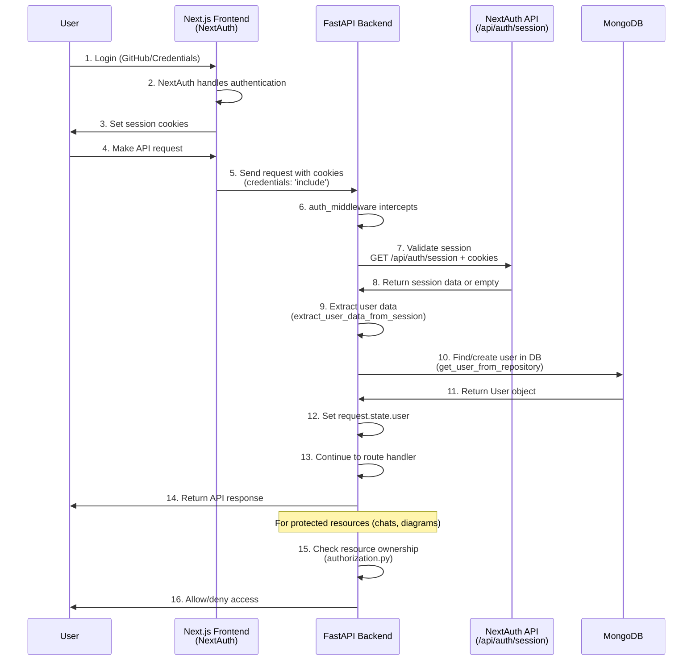

# CodeBuddy Authentication Flow

## Complete Authentication Flow Diagram



## File Structure Overview

```
backend/app/auth/
├── middleware.py          ✅ Main auth middleware
├── jwt_handler.py         ✅ NextAuth session validator  
├── dependencies.py        ✅ FastAPI auth dependencies
├── utils.py              ✅ User DB sync utilities
├── authorization.py      ✅ Resource ownership checks
└── token_utils.py        ✅ Session data extraction (cleaned up)
```

## Middleware Processing Flow

```mermaid
flowchart TD
    A[Incoming Request] --> B{Public Path?}
    B -->|Yes| C[Skip Auth - Continue]
    B -->|No| D[auth_middleware]
    
    D --> E[session_handler.validate_session]
    E --> F[Call NextAuth API<br/>GET /api/auth/session]
    F --> G{Valid Session?}
    
    G -->|No| H[Return 401 Unauthorized]
    G -->|Yes| I[extract_user_data_from_session]
    I --> J[Set request.state.user]
    J --> K[Continue to Route Handler]
    
    K --> L{Protected Resource?}
    L -->|No| M[Return Response]
    L -->|Yes| N[Check Ownership<br/>(authorization.py)]
    N --> O{User Owns Resource?}
    O -->|No| P[Return 403 Forbidden]
    O -->|Yes| M
```

## Route Protection Levels

### 1. **Public Routes** (No Auth Required)
- `/health`, `/docs`, `/redoc`
- `POST /user/` (registration)

### 2. **Authenticated Routes** (Auth Required)
- All `/chat/*`, `/tools/*`, `/diagram/*`, `/user/*` routes
- Uses `get_current_user` dependency

### 3. **Resource-Owned Routes** (Auth + Ownership)
- `GET /chat/{chat_id}` - User must own chat
- `PUT /diagram/{diagram_id}` - User must own diagram
- Uses `require_chat_ownership`, `require_diagram_ownership`

## Key Components

### 1. **Session Validation** (`jwt_handler.py`)
```python
# Calls NextAuth API with cookies
async def validate_session(request: Request) -> Dict[str, Any]:
    response = await client.get(
        f"{nextauth_url}/api/auth/session",
        cookies=request.cookies
    )
    return response.json()
```

### 2. **User Sync** (`utils.py`)
```python
# Auto-creates users from NextAuth data
async def get_user_from_repository(request, user_repo) -> User:
    user_data = await get_current_user_from_request(request)
    existing_user = await user_repo.find_by_email(user_data["email"])
    
    if not existing_user:
        # Create new user from NextAuth data
        return await user_repo.create(new_user_data)
    
    return existing_user
```

### 3. **Authorization** (`authorization.py`)
```python
# Resource ownership checks
async def require_chat_ownership(chat_id, current_user, chat_repo) -> Chat:
    chat = await chat_repo.find_by_id(chat_id)
    if str(chat.user_id) != str(current_user.id):
        raise HTTPException(403, "Access denied")
    return chat
```

## Environment Variables

```bash
# Backend Settings
NEXTAUTH_URL=http://localhost:3000  # Frontend NextAuth URL (set to production URL in deployment)
NEXTAUTH_SECRET=your_secret         # Should match frontend AUTH_SECRET
```

## Benefits of Current Approach

✅ **Simple**: No complex crypto, just API calls  
✅ **Reliable**: Uses NextAuth's own validation  
✅ **Flexible**: Works with any NextAuth configuration  
✅ **Maintainable**: Standard patterns, no custom JWT logic  
✅ **Secure**: Leverages NextAuth's security features  

## Cleaned Up Code

### ❌ **Removed Unnecessary Functions:**
- `get_token_from_cookie()` - No longer manually extracting tokens
- `get_token_from_header()` - Not using Bearer tokens
- `extract_user_data_from_jwt()` - Using session data instead

### ✅ **Kept Essential Functions:**
- `extract_user_data_from_session()` - Still needed for data normalization
- All middleware, dependencies, and authorization code