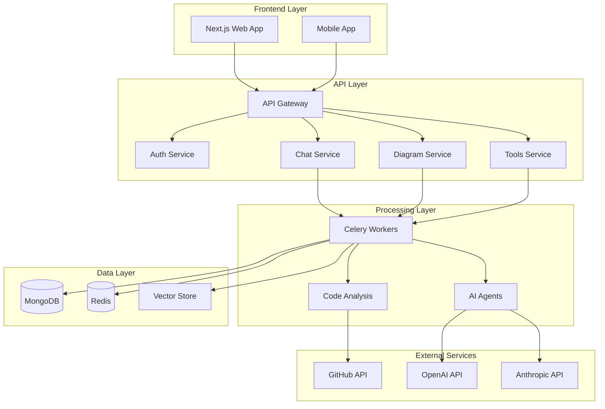
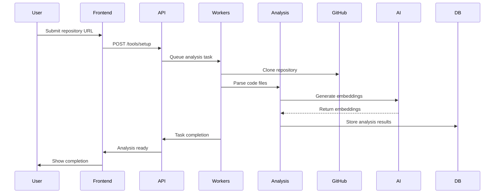
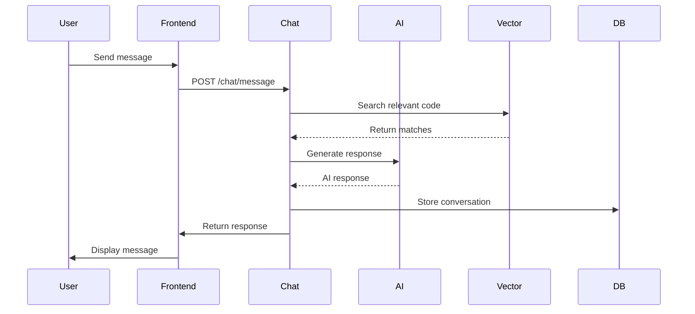
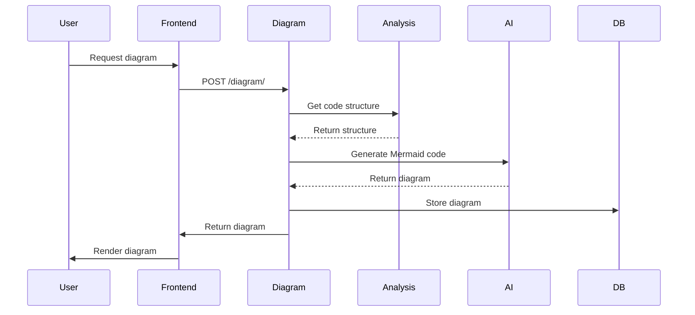
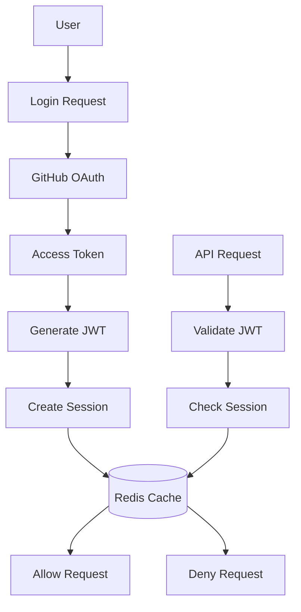
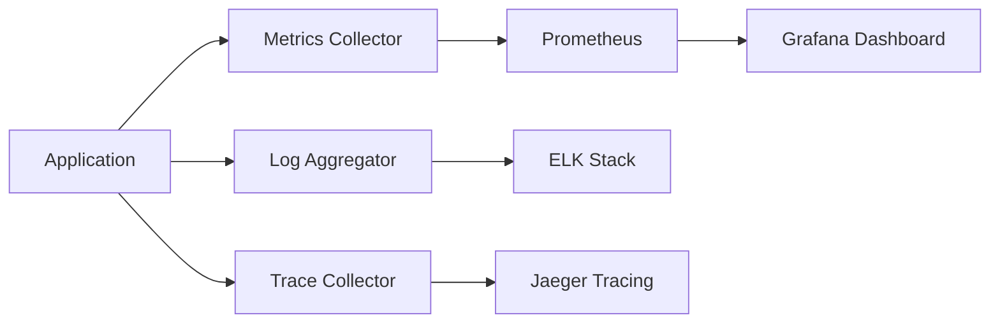
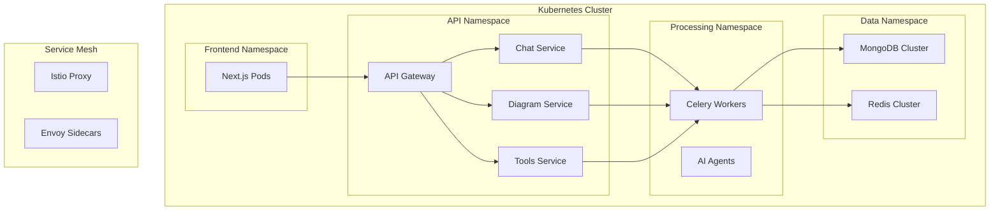

# 🏗️ Architecture Guide

Learn about CodeBuddy's system architecture, components, and how they work together to enable AI-powered code analysis and conversation.

## 🎯 System Overview

CodeBuddy is built as a distributed system with clear separation of concerns:



## 🔧 Core Components

### Frontend Layer

#### Next.js Web Application
- **Technology**: Next.js 15, TypeScript, Tailwind CSS
- **Purpose**: Primary user interface for code analysis and chat
- **Features**:
  - Server-side rendering for performance
  - Real-time chat interface
  - Interactive diagram editor
  - Repository management dashboard

#### Mobile Application
- **Technology**: React Native / Flutter (planned)
- **Purpose**: Mobile access to CodeBuddy features
- **Status**: In development

### API Layer

#### API Gateway
- **Technology**: FastAPI with custom routing
- **Purpose**: Central entry point for all client requests
- **Features**:
  - Request routing and load balancing
  - Authentication and authorization
  - Rate limiting and throttling
  - Request/response transformation

#### Microservices Architecture

Each service handles specific domain functionality:

| Service | Purpose | Technology | Port |
|---------|---------|------------|------|
| **Auth Service** | User authentication and authorization | FastAPI + JWT | 8001 |
| **Chat Service** | Conversational AI interface | FastAPI + WebSocket | 8002 |
| **Diagram Service** | Diagram generation and management | FastAPI + Mermaid | 8003 |
| **Tools Service** | Repository analysis and processing | FastAPI + Celery | 8004 |

### Processing Layer

#### Celery Workers
- **Technology**: Celery with Redis broker
- **Purpose**: Asynchronous task processing
- **Task Types**:
  - Repository cloning and analysis
  - Code embedding generation
  - AI model inference
  - File processing and indexing

#### AI Agents
- **Technology**: LiteLLM + Google ADK
- **Purpose**: Multi-model AI processing
- **Capabilities**:
  - Code understanding and explanation
  - Diagram generation from code
  - Natural language query processing
  - Context-aware conversation

#### Code Analysis Engine
- **Technology**: Tree-sitter + Custom parsers
- **Purpose**: Code structure analysis and extraction
- **Features**:
  - Multi-language parsing
  - Abstract syntax tree generation
  - Dependency graph construction
  - Code metrics calculation

### Data Layer

#### MongoDB
- **Purpose**: Primary data storage
- **Collections**:
  - `users` - User accounts and preferences
  - `repositories` - Repository metadata and analysis results
  - `chats` - Chat sessions and message history
  - `diagrams` - Generated diagrams and versions
  - `embeddings` - Code embeddings for semantic search

#### Redis
- **Purpose**: Caching and message broker
- **Use Cases**:
  - Session storage
  - Task queue management
  - Rate limiting counters
  - Temporary file storage
  - Real-time notifications

#### Vector Store
- **Technology**: Pinecone / Weaviate
- **Purpose**: Semantic code search
- **Features**:
  - High-dimensional embeddings storage
  - Similarity search
  - Metadata filtering
  - Scalable indexing

## 🌊 Data Flow Architecture

### Repository Analysis Flow



### Chat Conversation Flow



### Diagram Generation Flow



## 🔐 Security Architecture

### Authentication Flow



### Security Layers

1. **Transport Security**
   - HTTPS/TLS encryption
   - Certificate management
   - Secure headers

2. **Authentication**
   - GitHub OAuth integration
   - JWT token validation
   - Session management

3. **Authorization**
   - Role-based access control
   - Resource-level permissions
   - Rate limiting

4. **Data Protection**
   - Encryption at rest
   - Temporary file cleanup
   - Secure credential storage

## 📊 Monitoring and Observability

### Metrics Collection



### Key Metrics

#### Performance Metrics
- **Response Times**: API endpoint latency
- **Throughput**: Requests per second
- **Error Rates**: 4xx/5xx error percentages
- **Queue Depth**: Background task queue sizes

#### Business Metrics
- **Active Users**: Daily/monthly active users
- **Repository Analysis**: Repositories processed per day
- **Chat Messages**: Messages sent per session
- **Diagram Generation**: Diagrams created per user

#### System Metrics
- **Resource Usage**: CPU, memory, disk utilization
- **Database Performance**: Query times, connection pools
- **Cache Hit Rates**: Redis cache effectiveness
- **AI Model Performance**: Token usage, response times

## 🚀 Deployment Architecture

### Kubernetes Deployment

```yaml
# deployment.yaml
apiVersion: apps/v1
kind: Deployment
metadata:
  name: codebuddy-api
spec:
  replicas: 3
  selector:
    matchLabels:
      app: codebuddy-api
  template:
    metadata:
      labels:
        app: codebuddy-api
    spec:
      containers:
      - name: api
        image: codebuddy/api:latest
        ports:
        - containerPort: 8000
        env:
        - name: MONGODB_URL
          valueFrom:
            secretKeyRef:
              name: codebuddy-secrets
              key: mongodb-url
        - name: REDIS_URL
          valueFrom:
            secretKeyRef:
              name: codebuddy-secrets
              key: redis-url
        resources:
          requests:
            memory: "512Mi"
            cpu: "250m"
          limits:
            memory: "1Gi"
            cpu: "500m"
```

### Service Mesh Architecture



## 📈 Scalability Considerations

### Horizontal Scaling

#### Stateless Services
All API services are designed to be stateless:
- No server-side session storage
- Shared state in Redis/MongoDB
- Load balancer friendly

#### Auto-scaling Configuration
```yaml
apiVersion: autoscaling/v2
kind: HorizontalPodAutoscaler
metadata:
  name: codebuddy-api-hpa
spec:
  scaleTargetRef:
    apiVersion: apps/v1
    kind: Deployment
    name: codebuddy-api
  minReplicas: 2
  maxReplicas: 10
  metrics:
  - type: Resource
    resource:
      name: cpu
      target:
        type: Utilization
        averageUtilization: 70
  - type: Resource
    resource:
      name: memory
      target:
        type: Utilization
        averageUtilization: 80
```

### Database Scaling

#### MongoDB Sharding
```javascript
// Shard key strategy
sh.shardCollection("codebuddy.repositories", {"owner": 1, "name": 1})
sh.shardCollection("codebuddy.embeddings", {"repository_id": 1, "file_path": 1})
sh.shardCollection("codebuddy.chats", {"user_id": 1, "created_at": 1})
```

#### Redis Clustering
```yaml
apiVersion: v1
kind: ConfigMap
metadata:
  name: redis-cluster-config
data:
  redis.conf: |
    cluster-enabled yes
    cluster-config-file nodes.conf
    cluster-node-timeout 5000
    appendonly yes
```

## 🔧 Development Workflow

### Local Development Setup

```bash
# Clone repository
git clone https://github.com/infinitycastle147/CodeBuddy.git
cd codebuddy

# Start development environment
docker-compose -f docker-compose.dev.yml up -d

# Install dependencies
cd frontend && npm install
cd ../backend && pip install -r requirements.txt

# Start services
npm run dev          # Frontend (port 3000)
uvicorn main:app --reload  # Backend (port 8000)
celery -A app.celery worker  # Background workers
```

### CI/CD Pipeline

```yaml
# .github/workflows/deploy.yml
name: Deploy to Production
on:
  push:
    branches: [main]

jobs:
  test:
    runs-on: ubuntu-latest
    steps:
      - uses: actions/checkout@v3
      - name: Run Tests
        run: |
          pytest backend/tests/
          npm test --prefix frontend/
  
  build:
    needs: test
    runs-on: ubuntu-latest
    steps:
      - name: Build Docker Images
        run: |
          docker build -t codebuddy/api:${{ github.sha }} ./backend
          docker build -t codebuddy/frontend:${{ github.sha }} ./frontend
      
      - name: Push to Registry
        run: |
          docker push codebuddy/api:${{ github.sha }}
          docker push codebuddy/frontend:${{ github.sha }}
  
  deploy:
    needs: build
    runs-on: ubuntu-latest
    steps:
      - name: Deploy to Kubernetes
        run: |
          kubectl set image deployment/codebuddy-api \
            api=codebuddy/api:${{ github.sha }}
          kubectl rollout status deployment/codebuddy-api
```

## 🎯 Performance Optimization

### Caching Strategy

#### Multi-Level Caching
```python
# L1: Application-level cache
@lru_cache(maxsize=1000)
def get_user_preferences(user_id):
    # Cached in memory
    pass

# L2: Redis cache
@redis_cache(ttl=3600)
def get_repository_analysis(repo_id):
    # Cached in Redis
    pass

# L3: Database query optimization
class Repository:
    @property
    @cached_property
    def complexity_score(self):
        # Cached as database field
        pass
```

#### Cache Invalidation
```python
# Event-driven cache invalidation
@app.event_handler("repository.updated")
def invalidate_repository_cache(repo_id):
    redis_client.delete(f"repo:analysis:{repo_id}")
    redis_client.delete(f"repo:embeddings:{repo_id}")
```

### Database Optimization

#### Query Optimization
```javascript
// Compound indexes for common queries
db.chats.createIndex({"user_id": 1, "created_at": -1})
db.embeddings.createIndex({"repository_id": 1, "file_path": 1})
db.repositories.createIndex({"owner": 1, "name": 1, "status": 1})

// Text search index
db.embeddings.createIndex({
  "content": "text",
  "function_name": "text", 
  "class_name": "text"
})
```

#### Connection Pooling
```python
# MongoDB connection pool
client = AsyncIOMotorClient(
    MONGODB_URL,
    maxPoolSize=100,
    minPoolSize=10,
    maxIdleTimeMS=30000,
    serverSelectionTimeoutMS=5000
)
```

## 🔮 Future Architecture Plans

### Planned Enhancements

1. **Edge Computing**
   - CDN integration for static assets
   - Edge functions for low-latency responses
   - Distributed caching strategy

2. **AI Model Optimization**
   - Model quantization and optimization
   - Custom fine-tuned models
   - Local model inference capabilities

3. **Real-time Collaboration**
   - WebSocket-based real-time features
   - Collaborative diagram editing
   - Live code analysis sharing

4. **Advanced Analytics**
   - Usage pattern analysis
   - Performance prediction
   - Automated optimization recommendations

---

This architecture provides a solid foundation for CodeBuddy's current needs while remaining flexible for future growth and enhancements. 🚀