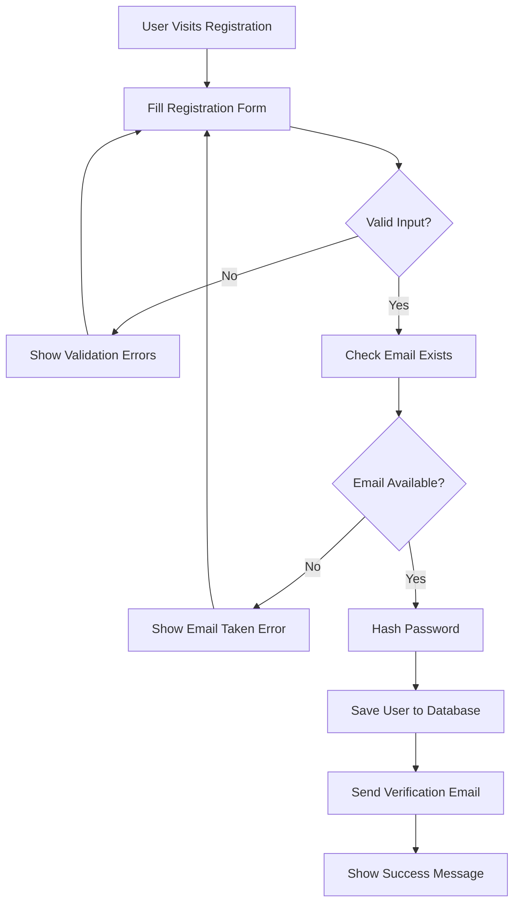
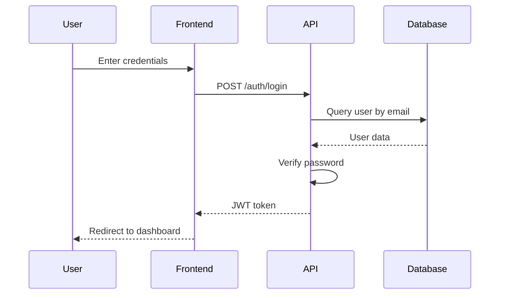
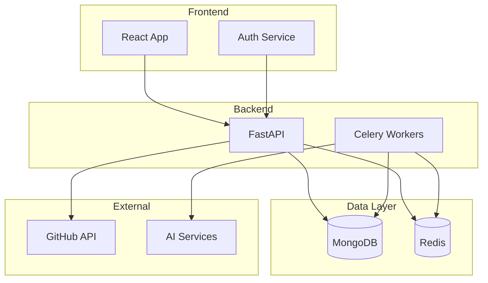
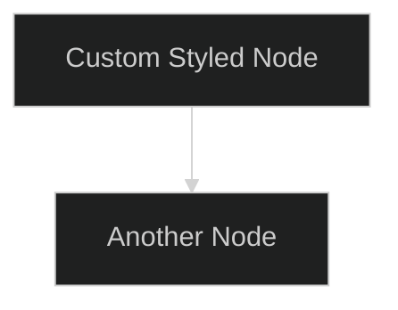
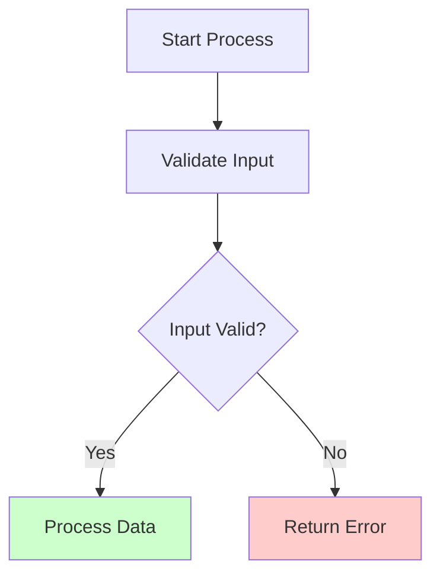
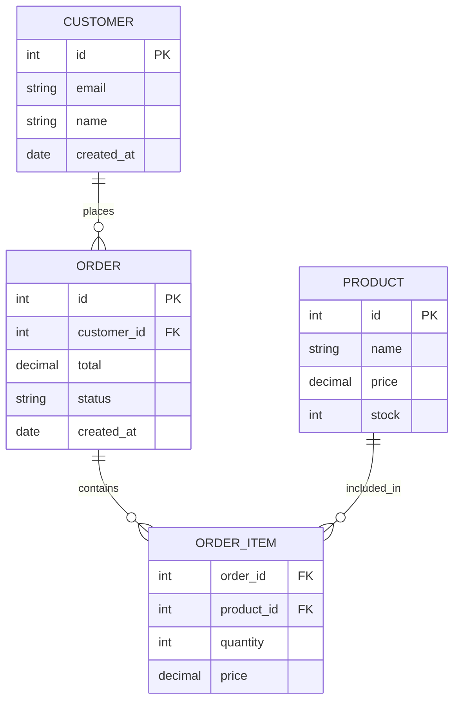
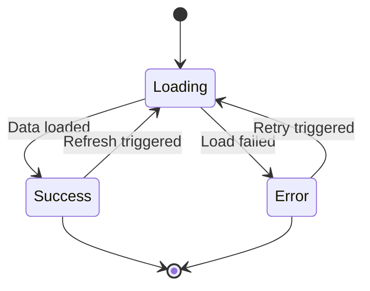
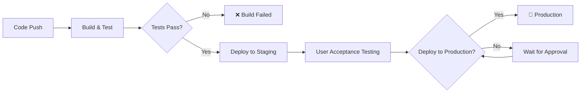
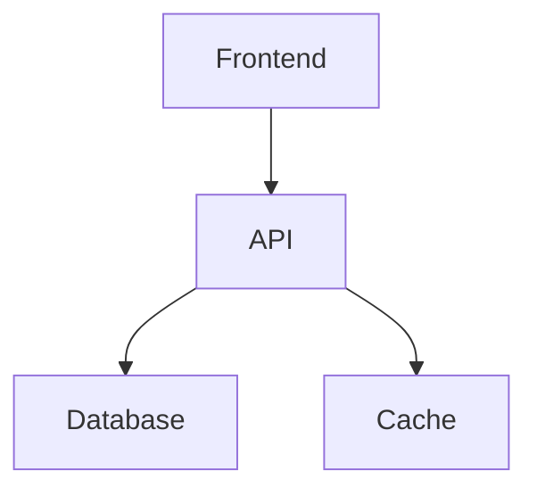

# 📊 Diagram Generation Guide

Learn how to create beautiful, interactive diagrams from your codebase using CodeBuddy's AI-powered diagram generation. From simple flowcharts to complex architecture diagrams, visualize your code like never before.

## 🎯 Overview

CodeBuddy can automatically generate various types of diagrams:
- **Flowcharts** - Process flows and decision trees
- **Sequence Diagrams** - API interactions and workflows
- **Class Diagrams** - Object relationships and inheritance
- **Architecture Diagrams** - System design and components
- **ER Diagrams** - Database schemas and relationships

All diagrams are generated as **Mermaid** syntax, making them easy to embed, edit, and version control.

## 🚀 Creating Your First Diagram

### Step 1: Navigate to Diagrams

1. Go to the **Diagrams** section in your CodeBuddy dashboard
2. Click **"Create New Diagram"**
3. Ensure your repository has been analyzed

### Step 2: Describe What You Want

Use natural language to describe the diagram you want:

```
Examples:
• "Create a flowchart of the user authentication process"
• "Generate a sequence diagram for the API payment flow"
• "Show the class relationships in the user management system"
• "Create an architecture diagram of the microservices"
```

### Step 3: Review and Refine

CodeBuddy will generate a Mermaid diagram based on your code analysis. You can:
- **View the visual diagram** - See the rendered diagram
- **Edit the source** - Modify the Mermaid code directly
- **Regenerate** - Ask for variations or improvements

## 📊 Diagram Types

### 1. Flowcharts

Perfect for showing process flows, algorithms, and decision trees.

**Example Request**: *"Create a flowchart of the user registration process"*



### 2. Sequence Diagrams

Ideal for showing interactions between components over time.

**Example Request**: *"Show the sequence diagram for user login"*



### 3. Class Diagrams

Great for showing object relationships and inheritance hierarchies.

**Example Request**: *"Generate a class diagram for the user system"*

```mermaid
classDiagram
    class User {
        +String id
        +String email
        +String name
        +Date createdAt
        +Boolean isActive
        +login()
        +logout()
        +updateProfile()
    }
    
    class Profile {
        +String userId
        +String bio
        +String avatarUrl
        +updateAvatar()
    }
    
    class Role {
        +String name
        +String[] permissions
        +addPermission()
    }
    
    User ||--|| Profile : has
    User }o--o{ Role : assigned
```

### 4. Architecture Diagrams

Show system components and their relationships.

**Example Request**: *"Create an architecture diagram of the application"*



## 🎨 Advanced Diagram Techniques

### Multi-Level Detail

Create diagrams at different levels of abstraction:

```
Level 1: "Show the overall system architecture"
Level 2: "Detail the authentication service from the previous diagram"
Level 3: "Show the step-by-step login function flow"
```

### Comparative Diagrams

Compare different approaches or versions:

```
"Compare the old synchronous payment flow with the new async implementation"
"Show before and after diagrams for the database migration"
```

### Cross-Service Diagrams

Visualize interactions across multiple services:

```
"Create a sequence diagram showing how user data flows between frontend, API, and microservices"
```

## 🛠️ Editing and Customization

### Mermaid Editor

CodeBuddy provides a built-in editor for fine-tuning diagrams:

```
┌─────────────────────────────────────┐
│ 📊 Diagram Editor                   │
├─────────────────────────────────────┤
│ Source Code         │ Preview       │
│                     │               │
│ flowchart TD        │ [Visual       │
│   A --> B           │  Diagram      │
│   B --> C           │  Preview]     │
│                     │               │
├─────────────────────────────────────┤
│ [Save] [Export] [Share] [Validate]  │
└─────────────────────────────────────┘
```

### Styling Options

Customize diagram appearance:



### Adding Annotations

Include additional information:



## 📋 Example Use Cases

### 1. API Documentation

**Request**: *"Create diagrams for all REST API endpoints"*

```mermaid
graph LR
    Client --> Auth[/auth]
    Client --> Users[/users]
    Client --> Chat[/chat]
    Client --> Diagrams[/diagrams]
    
    Auth --> Login[POST /login]
    Auth --> Register[POST /register]
    
    Users --> GetUser[GET /users/:id]
    Users --> UpdateUser[PUT /users/:id]
    
    Chat --> CreateChat[POST /chat]
    Chat --> SendMessage[POST /chat/:id/message]
```

### 2. Database Schema Visualization

**Request**: *"Show the database relationships for the e-commerce system"*



### 3. State Management Flow

**Request**: *"Visualize the Redux state management flow"*



### 4. Deployment Pipeline

**Request**: *"Show the CI/CD deployment pipeline"*



## 🔧 Integration and Export

### Embedding in Documentation

Use diagrams in your project documentation:

````markdown
## System Architecture

Here's how our system is structured:


````

### Exporting Diagrams

Export diagrams in various formats:

- **PNG/SVG** - For presentations and documents
- **PDF** - For formal documentation
- **Raw Mermaid** - For version control and editing

### Version Control

Store diagram source code alongside your project:

```
docs/
├── architecture/
│   ├── system-overview.mmd
│   ├── api-flow.mmd
│   └── database-schema.mmd
├── processes/
│   ├── user-registration.mmd
│   └── payment-flow.mmd
```

## 🚀 Best Practices

### Writing Effective Diagram Requests

1. **Be Specific**: Mention the exact process or system component
2. **Provide Context**: Explain what aspect you want to visualize
3. **Specify Type**: Mention if you want a flowchart, sequence diagram, etc.
4. **Include Scope**: Define boundaries (which services, which data)

### Good Request Examples

```
✅ "Create a sequence diagram showing the OAuth authentication flow between frontend, backend, and GitHub"

✅ "Generate a flowchart of the error handling process in the payment system"

✅ "Show a class diagram of the user management module including User, Profile, and Role classes"

❌ "Make a diagram of the code" (too vague)
❌ "Show me everything" (too broad)
```

### Diagram Maintenance

1. **Update Regularly**: Regenerate diagrams when code changes
2. **Version Control**: Track changes to diagram source code
3. **Review Accuracy**: Ensure diagrams match current implementation
4. **Document Purpose**: Add descriptions explaining each diagram's purpose

### Performance Tips

1. **Scope Appropriately**: Large diagrams can be slow to generate and hard to read
2. **Break Down Complex Systems**: Create multiple focused diagrams instead of one huge diagram
3. **Use Hierarchical Approach**: Start with high-level overview, then drill down
4. **Cache Results**: Save generated diagrams for reuse

## 🎯 Troubleshooting

### Common Issues

#### Diagram Too Complex

```
❌ Problem: Generated diagram is too cluttered

✅ Solutions:
• Request more specific scope
• Break into multiple smaller diagrams
• Focus on particular aspect or layer
• Use hierarchical approach
```

#### Missing Components

```
❌ Problem: Important components missing from diagram

✅ Solutions:
• Ensure repository analysis is complete
• Specify which files/modules to include
• Ask for specific components by name
• Check if code is in analyzed directories
```

#### Incorrect Relationships

```
❌ Problem: Diagram shows wrong relationships

✅ Solutions:
• Provide more context about actual relationships
• Specify the type of relationship you want to show
• Edit the generated Mermaid code manually
• Ask for regeneration with more specific requirements
```

---

Ready to visualize your code? Head to the Diagram Studio and start creating beautiful diagrams of your codebase! 📊