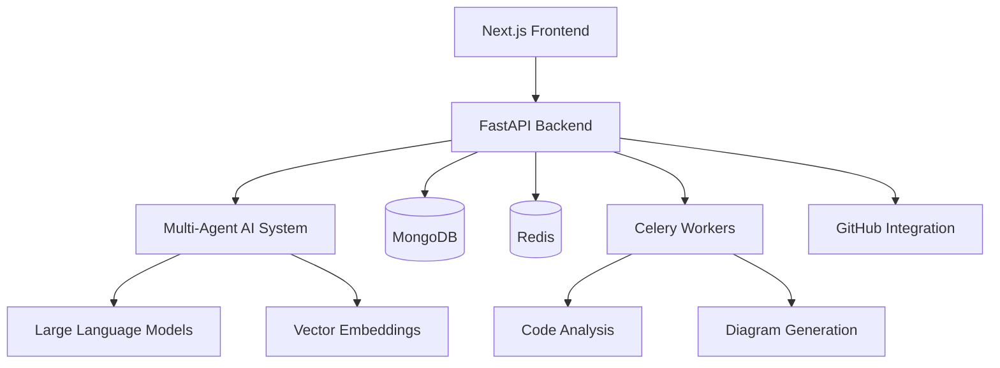

# CodeBuddy Documentation

Welcome to the comprehensive documentation for CodeBuddy - your AI-powered code companion that transforms how you understand, explore, and collaborate with code.

## 📚 Documentation Structure

### Getting Started
- [Quick Start Guide](./getting-started/quick-start.md) - Get up and running in minutes
- [Installation](./getting-started/installation.md) - Detailed setup instructions
- [Configuration](./getting-started/configuration.md) - Environment and service configuration

### User Guides
- [Chat with Code](./guides/chat.md) - Learn how to have conversations with your codebase
- [Diagram Generation](./guides/diagrams.md) - Create beautiful code visualizations
- [Repository Setup](./guides/repository-setup.md) - Connect and analyze your repositories

### API Reference
- [API Overview](./api/overview.md) - Introduction to CodeBuddy APIs
- [Chat API](./api/chat.md) - Conversational code analysis endpoints
- [Diagram API](./api/diagrams.md) - Code visualization endpoints
- [Tools API](./api/tools.md) - Repository processing and utilities

### Development
- [Architecture](./development/architecture.md) - System design and components

---

## 🚀 Quick Navigation

**New to CodeBuddy?** Start with our [Quick Start Guide](./getting-started/quick-start.md)

**Integrating with CodeBuddy?** Check out our [API Reference](./api/overview.md)

---

## 📖 What is CodeBuddy?

CodeBuddy is an intelligent code analysis platform that bridges the gap between developers and their codebases through:

- **🤖 Conversational AI** - Chat naturally with your code
- **📊 Visual Diagrams** - Auto-generate beautiful code visualizations  
- **🔍 Smart Search** - Find code using natural language
- **🛡️ Enterprise Security** - Built with security-first principles

### Core Features

| Feature | Description |
|---------|-------------|
| **Chat Interface** | Ask questions about your code in natural language |
| **Diagram Generation** | Create Mermaid diagrams from code structure |
| **Repository Analysis** | Deep analysis of GitHub repositories |
| **Multi-language Support** | Python, JavaScript, TypeScript, Java, Go, C++, C# |
| **Vector Search** | Semantic code search using embeddings |
| **Real-time Processing** | Background analysis with live updates |

---

## 🏗️ Architecture Overview

---

## 🤝 Community & Support

- **GitHub Issues** - Bug reports and feature requests
- **Documentation** - Comprehensive guides and API reference
- **Examples** - Real-world use cases and tutorials

---

*Ready to transform how you work with code? Let's get started!* 🚀
