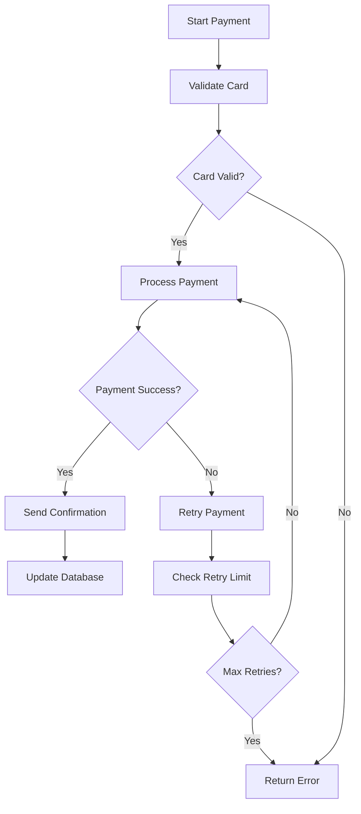
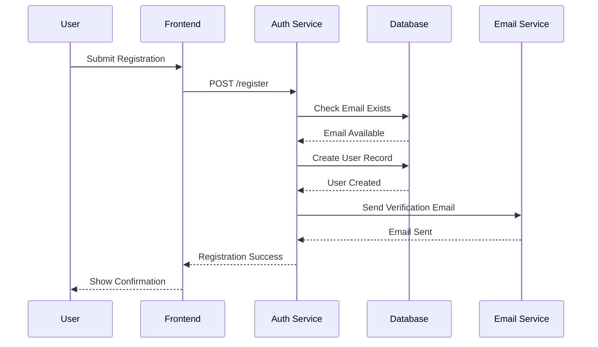
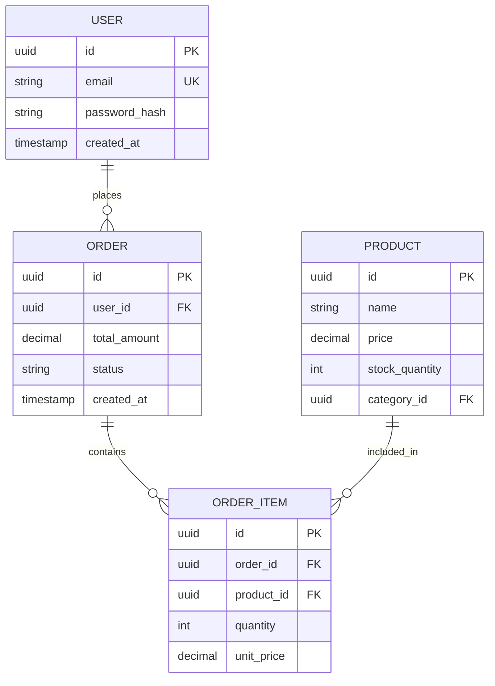
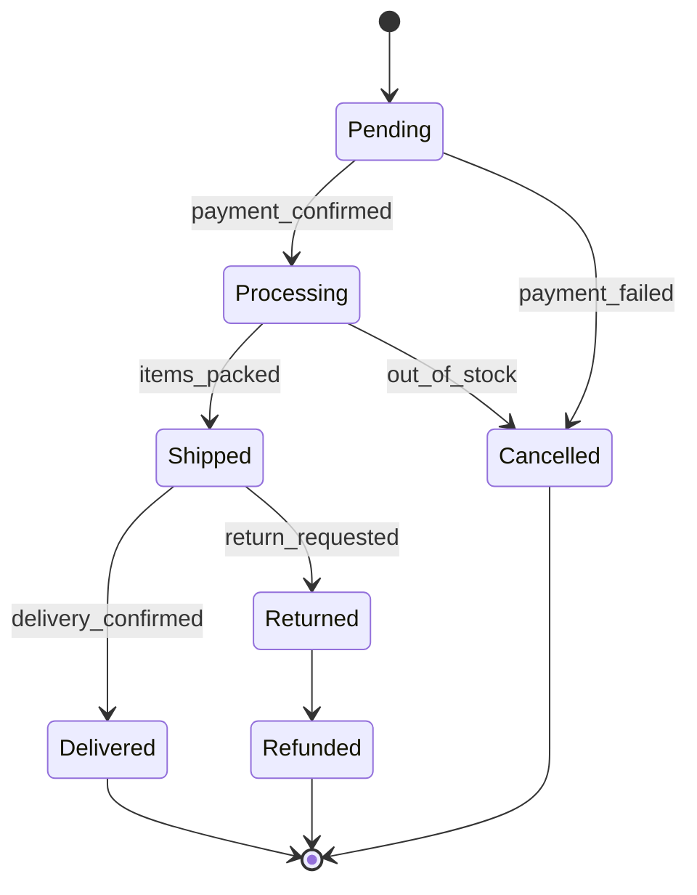
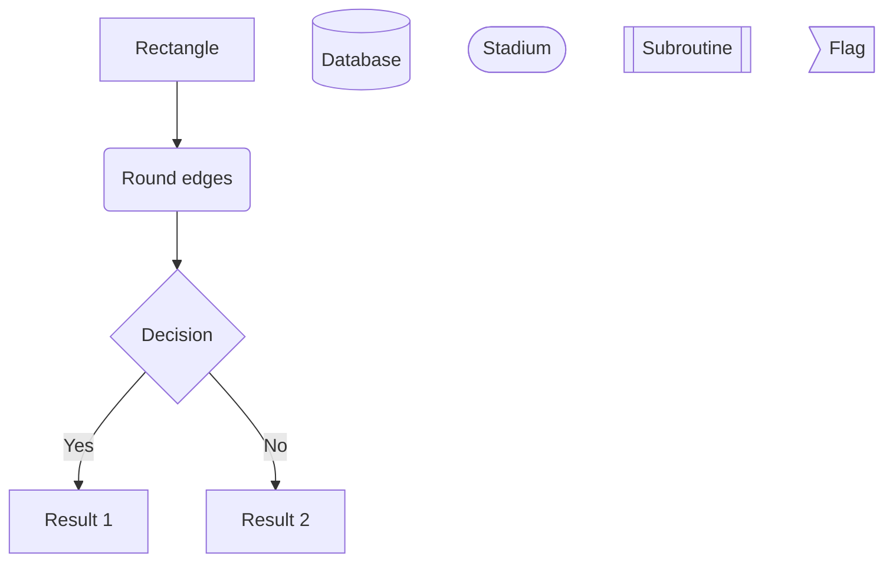
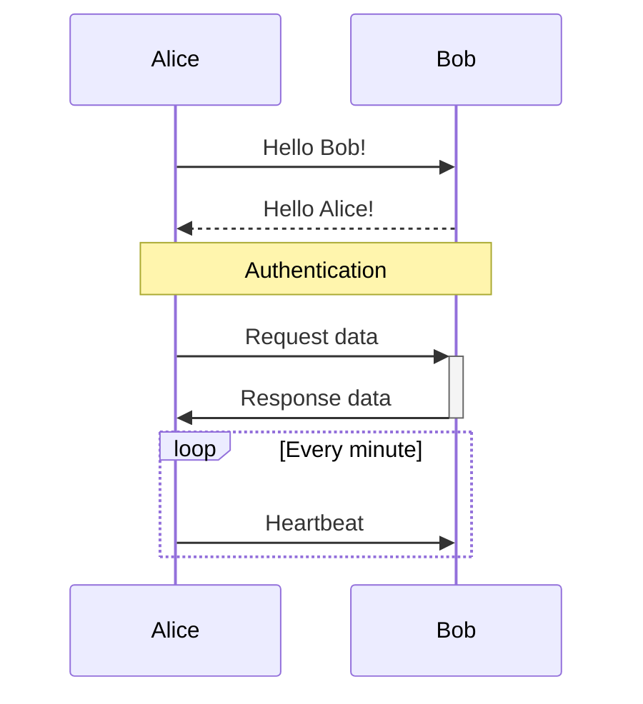
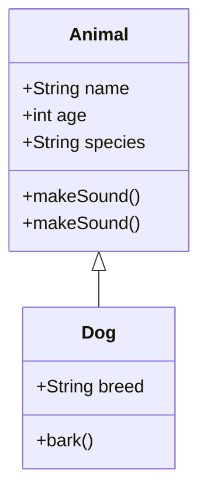
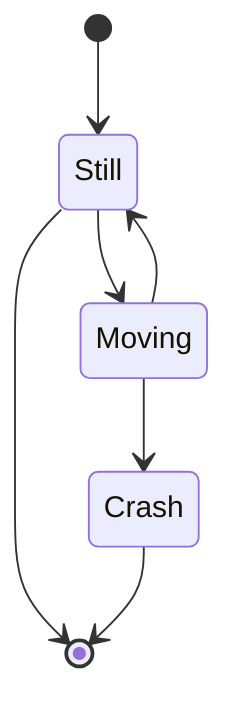
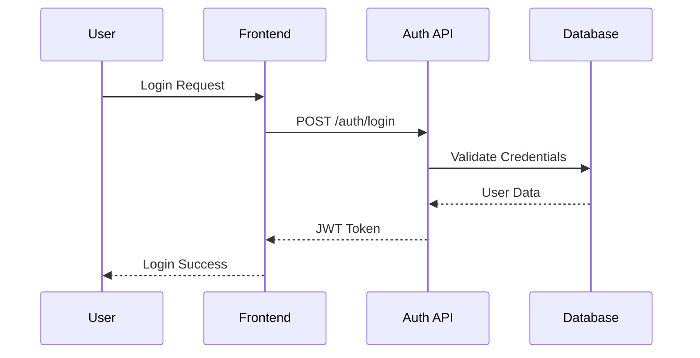
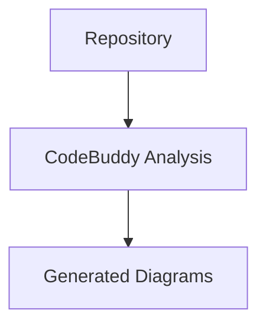

# 📊 Diagram API Guide

The Diagram API enables automatic generation of beautiful Mermaid diagrams from your codebase. Create flowcharts, sequence diagrams, class diagrams, and more using natural language descriptions.

## 🎯 Overview

The Diagram API provides endpoints to:
- Generate diagrams from code analysis
- List all created diagrams
- Retrieve specific diagrams
- Update diagram content
- Monitor diagram service health

## 🔗 Endpoints

### Base Path: `/diagram`

| Method | Endpoint | Description |
|--------|----------|-------------|
| `POST` | `/diagram/` | Generate new diagram |
| `GET` | `/diagram/` | List all diagrams |
| `GET` | `/diagram/{diagram_id}` | Get specific diagram |
| `PATCH` | `/diagram/{diagram_id}` | Update diagram content |
| `GET` | `/diagram/health` | Diagram service health check |

## 📊 Detailed Endpoint Reference

### 1. Create Diagram

Generate a new diagram based on code analysis and user input.

```http
POST /diagram/
```

**Request Body:**
```json
{
  "github_username": "string",
  "github_token": "string",
  "jira_username": "string",
  "jira_apiToken": "string",
  "jira_project_name": "string", 
  "jira_url": "string",
  "user_input": "string",
  "title": "string",
  "description": "string"
}
```

**Example Request:**
```bash
curl -X POST http://localhost:8000/diagram/ \
  -H "Content-Type: application/json" \
  -d '{
    "github_username": "octocat",
    "github_token": "ghp_your_personal_access_token",
    "user_input": "Create a flowchart showing the user authentication process",
    "title": "User Authentication Flow",
    "description": "Complete authentication workflow from login to session creation"
  }'
```

**Example Response:**
```json
{
  "diagram_id": "diag_f47ac10b-58cc-4372-a567-0e02b2c3d479",
  "title": "User Authentication Flow",
  "description": "Complete authentication workflow from login to session creation",
  "content": "flowchart TD\n    A[User Login] --> B{Valid Credentials?}\n    B -->|Yes| C[Generate JWT Token]\n    B -->|No| D[Return Error]\n    C --> E[Store Session]\n    E --> F[Redirect to Dashboard]\n    D --> G[Show Login Form]",
  "diagram_type": "flowchart",
  "created_at": "2024-01-15T10:30:00Z",
  "status": "completed",
  "metadata": {
    "processing_time_ms": 2450,
    "code_files_analyzed": ["auth.py", "models.py", "routes.py"],
    "confidence_score": 0.92
  }
}
```

**Response Codes:**
- `201` - Diagram created successfully
- `422` - Invalid request data
- `500` - Internal server error

### 2. List All Diagrams

Retrieve a list of all created diagrams.

```http
GET /diagram/
```

**Example Request:**
```bash
curl http://localhost:8000/diagram/
```

**Example Response:**
```json
{
  "diagrams": [
    {
      "diagram_id": "diag_f47ac10b-58cc-4372-a567-0e02b2c3d479",
      "title": "User Authentication Flow",
      "description": "Complete authentication workflow",
      "diagram_type": "flowchart",
      "created_at": "2024-01-15T10:30:00Z",
      "updated_at": "2024-01-15T10:30:00Z",
      "status": "completed"
    },
    {
      "diagram_id": "diag_a12bc34d-56ef-7890-1234-567890abcdef",
      "title": "Database Schema",
      "description": "Entity relationship diagram",
      "diagram_type": "erDiagram", 
      "created_at": "2024-01-15T09:15:00Z",
      "updated_at": "2024-01-15T09:15:00Z",
      "status": "completed"
    }
  ],
  "total_count": 2,
  "page": 1,
  "per_page": 20
}
```

**Response Codes:**
- `200` - Diagrams retrieved successfully
- `500` - Internal server error

### 3. Get Specific Diagram

Retrieve a specific diagram by its ID.

```http
GET /diagram/{diagram_id}
```

**Parameters:**
- `diagram_id` (path) - Unique identifier for the diagram

**Example Request:**
```bash
curl http://localhost:8000/diagram/diag_f47ac10b-58cc-4372-a567-0e02b2c3d479
```

**Example Response:**
```json
{
  "diagram_id": "diag_f47ac10b-58cc-4372-a567-0e02b2c3d479",
  "title": "User Authentication Flow",
  "description": "Complete authentication workflow from login to session creation",
  "content": "flowchart TD\n    A[User Login] --> B{Valid Credentials?}\n    B -->|Yes| C[Generate JWT Token]\n    B -->|No| D[Return Error]\n    C --> E[Store Session]\n    E --> F[Redirect to Dashboard]\n    D --> G[Show Login Form]",
  "diagram_type": "flowchart",
  "created_at": "2024-01-15T10:30:00Z",
  "updated_at": "2024-01-15T10:30:00Z",
  "status": "completed",
  "metadata": {
    "processing_time_ms": 2450,
    "code_files_analyzed": ["auth.py", "models.py", "routes.py"],
    "confidence_score": 0.92,
    "user_input": "Create a flowchart showing the user authentication process",
    "generation_model": "claude-3-sonnet",
    "repository_context": "octocat/Hello-World"
  },
  "versions": [
    {
      "version": 1,
      "created_at": "2024-01-15T10:30:00Z",
      "changes": "Initial generation"
    }
  ]
}
```

**Response Codes:**
- `200` - Diagram retrieved successfully
- `404` - Diagram not found
- `422` - Invalid diagram ID format
- `500` - Internal server error

### 4. Update Diagram

Update the content of an existing diagram.

```http
PATCH /diagram/{diagram_id}
```

**Parameters:**
- `diagram_id` (path) - Unique identifier for the diagram

**Request Body:**
```json
{
  "content": "string"
}
```

**Example Request:**
```bash
curl -X PATCH http://localhost:8000/diagram/diag_f47ac10b-58cc-4372-a567-0e02b2c3d479 \
  -H "Content-Type: application/json" \
  -d '{
    "content": "flowchart TD\n    A[User Login] --> B{Valid Credentials?}\n    B -->|Yes| C[Generate JWT Token]\n    B -->|No| D[Return Error]\n    C --> E[Store Session]\n    C --> H[Log Activity]\n    E --> F[Redirect to Dashboard]\n    D --> G[Show Login Form]\n    H --> I[Update Last Login]"
  }'
```

**Example Response:**
```json
{
  "diagram_id": "diag_f47ac10b-58cc-4372-a567-0e02b2c3d479",
  "title": "User Authentication Flow",
  "content": "flowchart TD\n    A[User Login] --> B{Valid Credentials?}\n    B -->|Yes| C[Generate JWT Token]\n    B -->|No| D[Return Error]\n    C --> E[Store Session]\n    C --> H[Log Activity]\n    E --> F[Redirect to Dashboard]\n    D --> G[Show Login Form]\n    H --> I[Update Last Login]",
  "updated_at": "2024-01-15T11:45:00Z",
  "version": 2,
  "status": "completed",
  "validation": {
    "syntax_valid": true,
    "render_test_passed": true,
    "warnings": []
  }
}
```

**Response Codes:**
- `200` - Diagram updated successfully
- `400` - Invalid Mermaid syntax
- `404` - Diagram not found
- `422` - Invalid request data
- `500` - Internal server error

### 5. Health Check

Check if the diagram service is operational.

```http
GET /diagram/health
```

**Example Request:**
```bash
curl http://localhost:8000/diagram/health
```

**Example Response:**
```json
{
  "status": "healthy",
  "service": "diagram",
  "timestamp": "2024-01-15T10:30:00Z",
  "version": "0.1.0",
  "dependencies": {
    "ai_service": "connected",
    "mermaid_renderer": "available",
    "database": "connected",
    "cache": "connected"
  },
  "metrics": {
    "diagrams_generated_today": 47,
    "average_generation_time_ms": 2100,
    "success_rate_percent": 94.5
  }
}
```

## 🎨 Supported Diagram Types

CodeBuddy can generate various types of Mermaid diagrams based on your code:

### 1. Flowcharts
Perfect for showing process flows, algorithms, and decision trees.

**Example Input:** `"Create a flowchart of the payment processing workflow"`

**Generated Output:**


### 2. Sequence Diagrams
Ideal for API interactions, service communications, and user workflows.

**Example Input:** `"Show the sequence diagram for user registration"`

**Generated Output:**


### 3. Class Diagrams
Great for showing object relationships and inheritance hierarchies.

**Example Input:** `"Generate a class diagram for the user management system"`

**Generated Output:**
```mermaid
classDiagram
    class User {
        +string id
        +string email
        +string password_hash
        +datetime created_at
        +boolean is_active
        +login()
        +logout()
        +reset_password()
    }
    
    class Profile {
        +string user_id
        +string first_name
        +string last_name
        +string avatar_url
        +update_profile()
    }
    
    class Role {
        +string id
        +string name
        +string[] permissions
    }
    
    User ||--|| Profile : has
    User }o--o{ Role : assigned
```

### 4. Entity Relationship Diagrams
Perfect for database schema visualization.

**Example Input:** `"Create an ER diagram for the e-commerce database"`

**Generated Output:**


### 5. State Diagrams
Excellent for showing state transitions and workflow states.

**Example Input:** `"Show the state diagram for order processing"`

**Generated Output:**


### 6. Git Flow Diagrams
Useful for showing branching strategies and version control workflows.

**Example Input:** `"Create a git flow diagram for our development process"`

**Generated Output:**
```mermaid
gitgraph:
    options:
        showBranches: true
        showCommitLabel: true
    
    commit id: "Initial commit"
    branch develop
    checkout develop
    commit id: "Setup project"
    
    branch feature/auth
    checkout feature/auth
    commit id: "Add authentication"
    commit id: "Add tests"
    
    checkout develop
    merge feature/auth
    
    branch release/v1.0
    checkout release/v1.0
    commit id: "Version bump"
    
    checkout main
    merge release/v1.0
    commit id: "v1.0 release"
    
    checkout develop
    merge release/v1.0
```

## 🤖 AI-Powered Diagram Generation

### How It Works

1. **Code Analysis**: AI analyzes your repository structure, functions, and relationships
2. **Pattern Recognition**: Identifies common patterns like MVC, microservices, or data flows
3. **Natural Language Processing**: Understands your diagram request in plain English
4. **Diagram Generation**: Creates appropriate Mermaid syntax based on analysis
5. **Validation**: Ensures generated diagrams are syntactically correct and renderable

### Smart Features

#### Context-Aware Generation
The AI considers your entire codebase when generating diagrams:

```bash
# Request
"Create a diagram showing how data flows through the application"

# AI Response considers:
- Database models and relationships
- API endpoints and routes
- Service layer interactions
- Frontend components
- External integrations
```

#### Multi-File Analysis
Diagrams can span multiple files and show cross-cutting concerns:

```bash
# Request
"Show the authentication flow across all services"

# AI analyzes:
- auth.py (authentication logic)
- models.py (user models)
- middleware.py (request processing)
- routes.py (endpoint definitions)
- frontend/auth.js (client-side logic)
```

#### Intelligent Abstraction
The AI chooses appropriate levels of detail:

```bash
# High-level request
"Show the system architecture"
# → Generates service-level diagram

# Detailed request  
"Show the detailed authentication function flow"
# → Generates step-by-step flowchart
```

## 🎯 Advanced Usage Patterns

### 1. Progressive Detail

Start with high-level diagrams and drill down:

```javascript
// Step 1: System overview
await createDiagram({
  user_input: "Show the overall system architecture",
  title: "System Architecture Overview"
});

// Step 2: Service detail
await createDiagram({
  user_input: "Detailed diagram of the authentication service",
  title: "Authentication Service Detail"
});

// Step 3: Function level
await createDiagram({
  user_input: "Flowchart of the login function step by step",
  title: "Login Function Flow"
});
```

### 2. Comparative Diagrams

Compare different implementations or approaches:

```bash
# Request
"Compare the old authentication flow with the new OAuth implementation"

# AI generates side-by-side or before/after diagrams
```

### 3. Documentation Integration

Generate diagrams for documentation:

```bash
# Request
"Create diagrams for the API documentation showing all endpoint interactions"

# AI creates multiple diagrams:
# - API overview
# - Authentication flow
# - Data flow diagrams
# - Error handling flows
```

### 4. Troubleshooting Diagrams

Create diagrams to help debug issues:

```bash
# Request
"Show the request flow when users report login timeouts"

# AI analyzes error patterns and creates diagnostic flow
```

## 🔧 Integration Examples

### Python Integration

```python
import asyncio
import aiohttp

class DiagramGenerator:
    def __init__(self, base_url, github_username, github_token):
        self.base_url = base_url
        self.auth = {
            "github_username": github_username,
            "github_token": github_token
        }
    
    async def create_diagram(self, user_input, title=None, description=None):
        async with aiohttp.ClientSession() as session:
            payload = {
                **self.auth,
                "user_input": user_input,
                "title": title,
                "description": description
            }
            
            async with session.post(
                f"{self.base_url}/diagram/",
                json=payload
            ) as response:
                if response.status == 201:
                    return await response.json()
                else:
                    raise Exception(f"Failed to create diagram: {response.status}")
    
    async def get_diagram(self, diagram_id):
        async with aiohttp.ClientSession() as session:
            async with session.get(
                f"{self.base_url}/diagram/{diagram_id}"
            ) as response:
                return await response.json()
    
    async def update_diagram(self, diagram_id, content):
        async with aiohttp.ClientSession() as session:
            async with session.patch(
                f"{self.base_url}/diagram/{diagram_id}",
                json={"content": content}
            ) as response:
                return await response.json()
    
    async def list_diagrams(self):
        async with aiohttp.ClientSession() as session:
            async with session.get(f"{self.base_url}/diagram/") as response:
                return await response.json()

# Usage Example
async def main():
    generator = DiagramGenerator(
        "http://localhost:8000",
        "username", 
        "ghp_token"
    )
    
    # Create authentication flow diagram
    auth_diagram = await generator.create_diagram(
        user_input="Create a sequence diagram for user login process",
        title="User Authentication Sequence",
        description="Shows the complete login flow from frontend to backend"
    )
    
    print(f"Created diagram: {auth_diagram['diagram_id']}")
    print(f"Mermaid content:\n{auth_diagram['content']}")
    
    # Create database schema diagram
    db_diagram = await generator.create_diagram(
        user_input="Generate an ER diagram for the database schema",
        title="Database Schema",
        description="Entity relationships for the application database"
    )
    
    # List all diagrams
    all_diagrams = await generator.list_diagrams()
    print(f"Total diagrams created: {all_diagrams['total_count']}")

asyncio.run(main())
```

### JavaScript/React Integration

```javascript
class DiagramAPI {
  constructor(baseURL, githubUsername, githubToken) {
    this.baseURL = baseURL;
    this.auth = {
      github_username: githubUsername,
      github_token: githubToken
    };
  }

  async createDiagram(userInput, title, description) {
    const response = await fetch(`${this.baseURL}/diagram/`, {
      method: 'POST',
      headers: { 'Content-Type': 'application/json' },
      body: JSON.stringify({
        ...this.auth,
        user_input: userInput,
        title,
        description
      })
    });

    if (!response.ok) {
      throw new Error(`HTTP ${response.status}: ${response.statusText}`);
    }

    return response.json();
  }

  async getDiagram(diagramId) {
    const response = await fetch(`${this.baseURL}/diagram/${diagramId}`);
    
    if (!response.ok) {
      throw new Error(`HTTP ${response.status}: ${response.statusText}`);
    }
    
    return response.json();
  }

  async updateDiagram(diagramId, content) {
    const response = await fetch(`${this.baseURL}/diagram/${diagramId}`, {
      method: 'PATCH',
      headers: { 'Content-Type': 'application/json' },
      body: JSON.stringify({ content })
    });

    if (!response.ok) {
      throw new Error(`HTTP ${response.status}: ${response.statusText}`);
    }

    return response.json();
  }

  async listDiagrams() {
    const response = await fetch(`${this.baseURL}/diagram/`);
    
    if (!response.ok) {
      throw new Error(`HTTP ${response.status}: ${response.statusText}`);
    }
    
    return response.json();
  }
}

// React Hook for Diagram Management
import { useState, useCallback } from 'react';

export function useDiagramAPI(baseURL, githubUsername, githubToken) {
  const [diagrams, setDiagrams] = useState([]);
  const [loading, setLoading] = useState(false);
  const [error, setError] = useState(null);

  const api = new DiagramAPI(baseURL, githubUsername, githubToken);

  const createDiagram = useCallback(async (userInput, title, description) => {
    setLoading(true);
    setError(null);

    try {
      const diagram = await api.createDiagram(userInput, title, description);
      setDiagrams(prev => [diagram, ...prev]);
      return diagram;
    } catch (err) {
      setError(err.message);
      throw err;
    } finally {
      setLoading(false);
    }
  }, [api]);

  const loadDiagrams = useCallback(async () => {
    setLoading(true);
    setError(null);

    try {
      const result = await api.listDiagrams();
      setDiagrams(result.diagrams);
      return result;
    } catch (err) {
      setError(err.message);
      throw err;
    } finally {
      setLoading(false);
    }
  }, [api]);

  const updateDiagram = useCallback(async (diagramId, content) => {
    setLoading(true);
    setError(null);

    try {
      const updated = await api.updateDiagram(diagramId, content);
      setDiagrams(prev => 
        prev.map(d => d.diagram_id === diagramId ? { ...d, ...updated } : d)
      );
      return updated;
    } catch (err) {
      setError(err.message);
      throw err;
    } finally {
      setLoading(false);
    }
  }, [api]);

  return {
    diagrams,
    loading,
    error,
    createDiagram,
    loadDiagrams,
    updateDiagram
  };
}

// React Component Example
import React, { useState, useEffect } from 'react';
import mermaid from 'mermaid';

function DiagramViewer({ diagramId, baseURL, githubUsername, githubToken }) {
  const [diagram, setDiagram] = useState(null);
  const [loading, setLoading] = useState(true);

  useEffect(() => {
    const api = new DiagramAPI(baseURL, githubUsername, githubToken);
    
    api.getDiagram(diagramId)
      .then(setDiagram)
      .catch(console.error)
      .finally(() => setLoading(false));
  }, [diagramId, baseURL, githubUsername, githubToken]);

  useEffect(() => {
    if (diagram?.content) {
      mermaid.initialize({ startOnLoad: true });
      mermaid.contentLoaded();
    }
  }, [diagram]);

  if (loading) return <div>Loading diagram...</div>;
  if (!diagram) return <div>Diagram not found</div>;

  return (
    <div>
      <h2>{diagram.title}</h2>
      <p>{diagram.description}</p>
      <div className="mermaid">
        {diagram.content}
      </div>
      <details>
        <summary>View Mermaid Source</summary>
        <pre><code>{diagram.content}</code></pre>
      </details>
    </div>
  );
}
```

### CLI Tool Example

```bash
#!/bin/bash

# diagram-cli.sh - Command line tool for CodeBuddy diagrams

CODEBUDDY_URL="${CODEBUDDY_URL:-http://localhost:8000}"
GITHUB_USERNAME="${GITHUB_USERNAME}"
GITHUB_TOKEN="${GITHUB_TOKEN}"

# Create a new diagram
create_diagram() {
    local input="$1"
    local title="$2"
    local description="$3"
    
    curl -s -X POST "$CODEBUDDY_URL/diagram/" \
        -H "Content-Type: application/json" \
        -d "{
            \"github_username\": \"$GITHUB_USERNAME\",
            \"github_token\": \"$GITHUB_TOKEN\",
            \"user_input\": \"$input\",
            \"title\": \"$title\",
            \"description\": \"$description\"
        }" | jq '.'
}

# List all diagrams
list_diagrams() {
    curl -s "$CODEBUDDY_URL/diagram/" | jq '.diagrams[]'
}

# Get specific diagram
get_diagram() {
    local diagram_id="$1"
    curl -s "$CODEBUDDY_URL/diagram/$diagram_id" | jq '.'
}

# Update diagram content
update_diagram() {
    local diagram_id="$1"
    local content="$2"
    
    curl -s -X PATCH "$CODEBUDDY_URL/diagram/$diagram_id" \
        -H "Content-Type: application/json" \
        -d "{\"content\": \"$content\"}" | jq '.'
}

# Main command dispatcher
case "$1" in
    create)
        create_diagram "$2" "$3" "$4"
        ;;
    list)
        list_diagrams
        ;;
    get)
        get_diagram "$2"
        ;;
    update)
        update_diagram "$2" "$3"
        ;;
    *)
        echo "Usage: $0 {create|list|get|update}"
        echo "  create 'description' 'title' 'description'"
        echo "  list"
        echo "  get diagram_id"
        echo "  update diagram_id 'new_content'"
        exit 1
        ;;
esac
```

Usage:
```bash
# Set environment variables
export GITHUB_USERNAME="your_username"
export GITHUB_TOKEN="ghp_your_token"

# Create a diagram
./diagram-cli.sh create "Create a flowchart of the payment process" "Payment Flow" "Shows payment processing steps"

# List all diagrams
./diagram-cli.sh list

# Get specific diagram
./diagram-cli.sh get diag_12345
```

## 🎨 Mermaid Syntax Reference

### Flowchart Syntax



### Sequence Diagram Syntax



### Class Diagram Syntax



### State Diagram Syntax



## 📊 Performance & Best Practices

### Optimization Tips

1. **Be Specific**: More specific requests generate better diagrams
   ```bash
   # Good
   "Create a sequence diagram for user authentication"
   
   # Better
   "Create a sequence diagram showing JWT token authentication with refresh token flow"
   ```

2. **Provide Context**: Include relevant details
   ```bash
   # Good
   "Show the database schema"
   
   # Better  
   "Show the database schema focusing on user management and order processing tables"
   ```

3. **Iterate and Refine**: Use the update endpoint to improve diagrams
   ```javascript
   // Generate initial diagram
   const diagram = await createDiagram("Show API endpoints");
   
   // Refine with more specific content
   const refined = await updateDiagram(diagram.diagram_id, improvedMermaidCode);
   ```

### Performance Metrics

| Operation | Typical Time | Complexity Factor |
|-----------|--------------|-------------------|
| Simple Flowchart | 1-2 seconds | Low |
| Sequence Diagram | 2-4 seconds | Medium |
| Class Diagram | 3-6 seconds | High |
| ER Diagram | 4-8 seconds | High |
| Complex Multi-file Analysis | 10-30 seconds | Very High |

### Rate Limits

- **Diagram Generation**: 20 per hour per user
- **Diagram Updates**: 50 per hour per user
- **Diagram Retrieval**: 200 per hour per user
- **Content Size**: Max 50KB per diagram

## 🔍 Troubleshooting

### Common Issues

#### Invalid Mermaid Syntax
```json
{
  "error": "invalid_mermaid_syntax",
  "message": "Generated diagram contains syntax errors",
  "details": {
    "line": 5,
    "error": "Unexpected token '>'"
  }
}
```

**Solution**: Use the update endpoint to fix syntax issues

#### Generation Timeout
```json
{
  "error": "generation_timeout", 
  "message": "Diagram generation took too long and was cancelled"
}
```

**Solution**: Try with a more specific or simpler request

#### Repository Access Issues
```json
{
  "error": "repository_access_denied",
  "message": "Cannot access repository for analysis"
}
```

**Solution**: Check GitHub token permissions

### Debug Mode

Enable detailed logging:

```bash
curl -X POST http://localhost:8000/diagram/ \
  -H "Content-Type: application/json" \
  -H "X-Debug-Mode: true" \
  -d '{
    "user_input": "debug this diagram generation",
    "title": "Debug Test"
  }'
```

Response includes debug information:
```json
{
  "diagram_id": "...",
  "debug_info": {
    "files_analyzed": ["file1.py", "file2.py"],
    "analysis_time_ms": 1200,
    "generation_steps": [
      "Code parsing completed",
      "Pattern recognition finished", 
      "Diagram template selected",
      "Mermaid code generated"
    ],
    "ai_confidence": 0.87
  }
}
```

## 🚀 Export & Integration

### Export Formats

While the API returns Mermaid code, you can render diagrams in various formats:

#### Web Rendering
```html
<!DOCTYPE html>
<html>
<head>
    <script src="https://cdn.jsdelivr.net/npm/mermaid/dist/mermaid.min.js"></script>
</head>
<body>
    <div class="mermaid">
        flowchart TD
            A[Start] --> B[Process]
    </div>
    <script>
        mermaid.initialize({startOnLoad:true});
    </script>
</body>
</html>
```

#### PNG/SVG Export
```javascript
// Using mermaid-cli for static exports
const mermaidCLI = require('@mermaid-js/mermaid-cli');

async function exportDiagram(mermaidCode, format = 'png') {
    const outputFile = `diagram.${format}`;
    await mermaidCLI.run(['-i', 'input.mmd', '-o', outputFile]);
    return outputFile;
}
```

#### PDF Integration
```python
from weasyprint import HTML, CSS
import base64

def diagram_to_pdf(mermaid_code, title="Diagram"):
    # Render Mermaid to SVG first
    svg_content = render_mermaid_to_svg(mermaid_code)
    
    html_content = f"""
    <html>
        <body>
            <h1>{title}</h1>
            {svg_content}
        </body>
    </html>
    """
    
    HTML(string=html_content).write_pdf("diagram.pdf")
```

### Documentation Integration

#### Markdown Integration
```markdown
# Authentication Flow

The user authentication process follows this sequence:



This diagram shows...
```

#### Wiki Integration
Many wikis support Mermaid diagrams natively:

```markdown
<!-- GitHub Wiki -->


<!-- Confluence -->
{mermaid}
graph TD
    A[Start] --> B[End]
{mermaid}
```

## 🔄 Workflow Integration

### CI/CD Pipeline Integration

```yaml
# .github/workflows/docs.yml
name: Update Documentation Diagrams

on:
  push:
    branches: [main]
    paths: ['src/**/*.py']

jobs:
  update-diagrams:
    runs-on: ubuntu-latest
    steps:
      - uses: actions/checkout@v3
      
      - name: Generate Architecture Diagram
        run: |
          curl -X POST "${{ secrets.CODEBUDDY_URL }}/diagram/" \
            -H "Content-Type: application/json" \
            -d '{
              "github_username": "${{ github.actor }}",
              "github_token": "${{ secrets.GITHUB_TOKEN }}",
              "user_input": "Update the system architecture diagram",
              "title": "System Architecture"
            }' > architecture.json
      
      - name: Update README
        run: |
          DIAGRAM_ID=$(jq -r '.diagram_id' architecture.json)
          MERMAID_CODE=$(jq -r '.content' architecture.json)
          # Update README.md with new diagram
```

### Pre-commit Hooks

```bash
#!/bin/sh
# .git/hooks/pre-commit

# Generate updated diagrams before commit
if git diff --cached --name-only | grep -E '\.(py|js|ts); then
    echo "Updating code diagrams..."
    
    # Generate class diagram for Python changes
    if git diff --cached --name-only | grep '\.py; then
        ./scripts/update-class-diagram.sh
    fi
    
    # Generate API sequence diagrams for route changes
    if git diff --cached --name-only | grep 'routes/'; then
        ./scripts/update-api-diagrams.sh
    fi
fi
```

## 📚 Examples & Templates

### Common Diagram Patterns

#### Microservices Architecture
```bash
curl -X POST http://localhost:8000/diagram/ \
  -d '{
    "user_input": "Show microservices architecture with API gateway, user service, order service, and payment service",
    "title": "Microservices Architecture"
  }'
```

#### Data Flow Diagram
```bash
curl -X POST http://localhost:8000/diagram/ \
  -d '{
    "user_input": "Create a data flow diagram showing how user data moves from frontend through API to database",
    "title": "User Data Flow"
  }'
```

#### Error Handling Flow
```bash
curl -X POST http://localhost:8000/diagram/ \
  -d '{
    "user_input": "Show error handling flow with try-catch blocks, logging, and user notifications",
    "title": "Error Handling Process"
  }'
```

## 🔄 What's Next?

- **[Tools API](./tools.md)** - Repository processing and analysis
- **[User Management](./users.md)** - User operations and permissions
- **[Advanced Features](../guides/advanced-features.md)** - Power user capabilities
- **[Authentication Guide](./authentication.md)** - Security best practices

---

**Ready to visualize your code?** Try the interactive examples or explore our [Diagram Guide](../guides/diagram-guide.md)! 📊